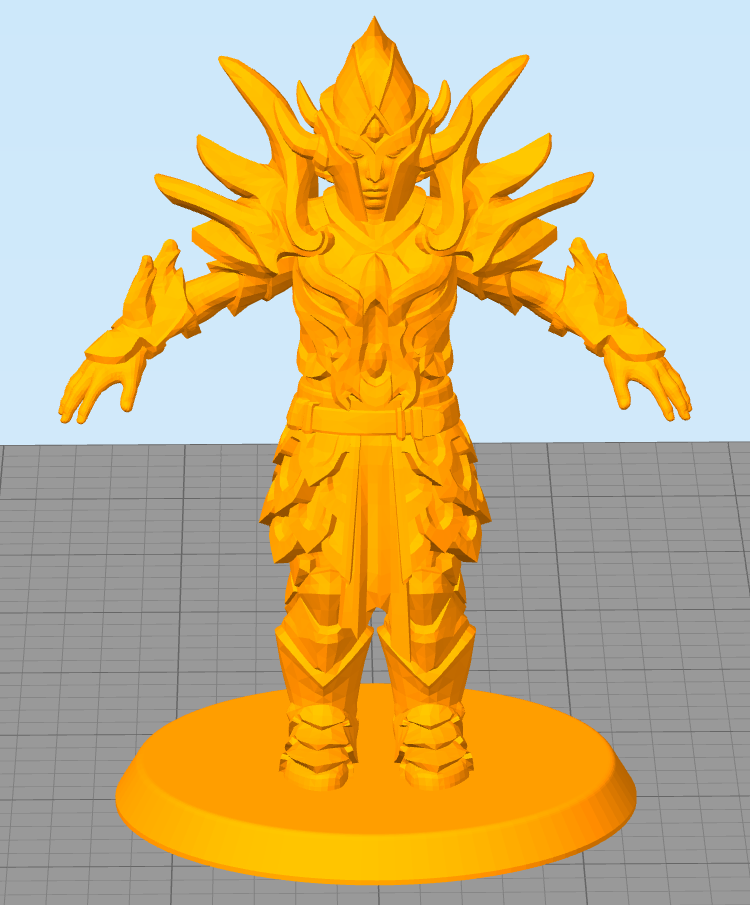

* In chrome, press Ctrl+Shift+i to open developer mode.
* Click the "Console" tab.
* Paste the following code into the input, then press enter

```
function addPart(e){if(e.geometry){for(var t=e.geometry.index.array,r=e.geometry.attributes.position.array,o=0;o<t.length;o+=3)indexStr+="f "+(t[o]+vertexOffset)+" "+(t[o+1]+vertexOffset)+" "+(t[o+2]+vertexOffset)+"\n";for(var o=0;o<r.length;o+=3)posStr+="v "+Math.round(1e6*r[o])/1e6+" "+Math.round(1e6*r[o+1])/1e6+" "+Math.round(1e6*r[o+2])/1e6+"\n",vertexOffset++}for(var o=0;o<e.children.length;o++){var n=e.children[o];addPart(n)}}function mitch(){confirm("Did you save?\nRunning this script will take you away from this window.\nClick ok to continue or cancel to do nothing")&&(addPart(CK.activeCharacter.threeObj),document.write("<a id='mitchrocks' style='display:none' href='data:text/html,"+encodeURI(posStr+"\n"+indexStr)+"' download='model.obj'>Click here to download your model</a>Your model is downloading!<br>You can use an online model viewer like <a href='https://3dviewer.net/'>3dviewer.net</a> to check it out!"),document.write("<script>document.getElementById('mitchrocks').click()</script>"),document.write('<br><br>Did your download fail?  If so, copy/paste the data below into notepad, and save the file as "Model.obj"<br><textarea>'+posStr+"\n"+indexStr+"</textarea>"))}var posStr="",indexStr="",vertexOffset=1;
```

* Known Bug: Poses don't work



